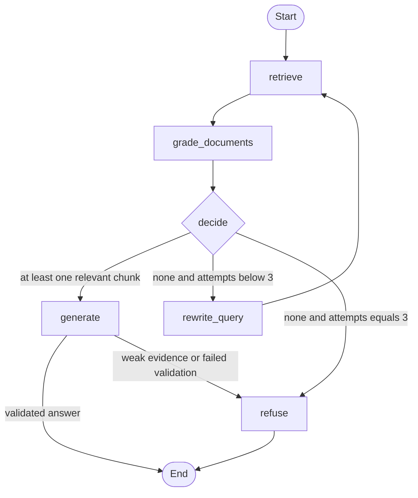

# Rowing Rules Agent: Evidence-Gated Q&A over the USRowing Rules of Rowing

A small Python agent that answers rowing rules questions from a local copy of the official USRowing rulebook. It checks retrieved evidence, retries unsuccessful searches, and refuses when it cannot support a complete answer. LangGraph controls the workflow; the OpenAI API provides embeddings and structured LLM responses.

## Why I built this

I rowed competitively for years, including as an NCAA Division I athlete at USC. Rules questions come up constantly at regattas, and a wrong answer can mean a penalty or disqualification. Previously I built a RAG research tool at a VC firm; this project adds an agentic layer that checks its own evidence, retries, and refuses instead of guessing.

## Graph



## How it works

- **retrieve:** Rank local rule chunks by embedding similarity and return the top four.
- **grade_documents:** Keep only chunks the LLM grades relevant to the original question, with a one-line reason per chunk.
- **decide:** Generate if evidence exists, rewrite if none exists and retries remain, or refuse after three rewrites.
- **rewrite_query:** Improve search wording while preserving the original question and incrementing the retry count.
- **generate:** Produce a typed answer, validate exact quotes and rule/page metadata, then check that evidence supports the full answer.
- **refuse:** Return `Not enough evidence in the sources to answer.` with no citations and low confidence.

The typed state records the question, retrieval query, attempts, grades, relevant chunks, answer, refusal reason, and executed path. Attempts start at zero, allowing the initial retrieval plus three rewrites. Generation also refuses on low confidence, missing citations, fabricated quotes, or failed support checks. API errors remain errors rather than evidence refusals.

`Citation` contains `rule: str`, `page: int`, and `quote: str`. `Answer` contains `answer: str`, `citations: list[Citation]`, and `confidence: Literal["high", "medium", "low"]`.

## Source and chunking

Download the rulebook from [USRowing's official Rules of Rowing page](https://usrowing.org/resources/rules-of-rowing). This project was verified with the [2026 edition PDF](https://usrowing-craft-storage-production.nyc3.digitaloceanspaces.com/staging/2026ROR-Final-Web2.pdf). Save it as `data/usrowing-rules.pdf`. **The PDF is USRowing's document and is not committed; users must download it themselves.**

`pypdf` extracts text from the numbered Rules of Racing, producing 292 chunks across 160 rules from PDF pages 12–87. The table of contents, change summary, and accompanying manuals are excluded. Rule sections are kept together when possible and split at page boundaries so every citation identifies the actual page containing its quote. Long sections use up to 800 characters with 120-character overlap. Whitespace and line-break hyphenation are normalized; exact quotes are validated against that normalized chunk text. Page numbers are one-based PDF positions.

Embeddings are stored in an ignored `.cache/` directory and reused across questions and program restarts. A cache key includes the PDF hash, embedding model, extracted chunks, and pypdf version. A changed PDF, extraction, or model triggers a new embedding pass; query embeddings are still created per retrieval. Search uses in-memory cosine similarity, with no external web search at runtime.

## Setup

Requires Python 3.11+ and an OpenAI API key.

```bash
cd rowing-rules-agent
python3 -m venv .venv
source .venv/bin/activate
python -m pip install -r requirements.txt
cp .env.example .env
```

Edit `.env` to set `OPENAI_API_KEY`. If you already have a configured `.env`, keep it instead of copying the example over it. Defaults are `gpt-4.1-mini` and `text-embedding-3-small`; optional model settings are in `.env.example`. The key is loaded relative to the project, and existing environment variables take precedence.

```bash
mkdir -p data
curl -fL 'https://usrowing-craft-storage-production.nyc3.digitaloceanspaces.com/staging/2026ROR-Final-Web2.pdf' -o data/usrowing-rules.pdf
python main.py "What is the minimum diameter of a boat's bowball?"
python eval.py
python -m unittest -v
```

The API receives the query and retrieved rule text, and calls incur usage charges. `.env`, the PDF, the virtual environment, and the embedding cache are gitignored.

## Real outputs

The following outputs were captured by `eval.py` in the final live run recorded in [eval_results.json](eval_results.json).

### Answered example

Question: What is the minimum diameter of a boat's bowball?

```text
PASS | expected answer | got answer | What is the minimum diameter of a boat's bowball?
  The minimum diameter of a boat's bowball shall be at least 4 centimeters.
  Rule 3-105, page 41: "The bowball shall be at least 4 centimeters in diameter."
  Path: retrieve -> grade_documents -> generate
```

### Refusal example

Question: Who won the 2024 Olympic women's eight?

```text
PASS | expected refusal | got refusal | Who won the 2024 Olympic women's eight?
  Not enough evidence in the sources to answer.
  Path: retrieve -> grade_documents -> rewrite_query -> retrieve -> grade_documents -> rewrite_query -> retrieve -> grade_documents -> rewrite_query -> retrieve -> grade_documents -> refuse
```

## Evaluation results

**4/6 correct**, with no API errors. Completed 2026-09-28T07:43:47.772162+00:00 using `gpt-4.1-mini` and `text-embedding-3-small`. The first run before a section-parser correction also scored 4/6; the table below is the final corrected-code run.

| Question | Expected | Observed | Result |
| --- | --- | --- | --- |
| In an on-water race, what penalty is assessed for a false start, and what happens after two warnings in the same race? | answer | refusal | FAIL |
| What is the minimum diameter of a boat's bowball? | answer | answer | PASS |
| Under the general coxswain rules, may a male coxswain compete in a women's event? | answer | answer | PASS |
| Who is responsible for a crew's steering, and when will the referee instruct it to alter course? | answer | refusal | FAIL |
| Who won the 2024 Olympic women's eight? | refusal | refusal | PASS |
| What is USC's rowing budget? | refusal | refusal | PASS |

The four answerable questions were verified in extracted Rules 2-308 (page 25), 3-105 (page 41), 4-105 (page 52), and 2-402 (page 27) before running. `eval.py` checks those source facts on startup so an edition change cannot silently reuse stale expectations. The two out-of-scope questions ask for Olympic results and a university budget, neither of which is supplied by these rules.

The false-start and steering cases reached generation, but their generated citations failed the exact rule/page/quote validation gate. Both are **false refusals**, counted as failures. The two returned answers were reviewed against the source quotes. The score measures answer/refusal classification, not comprehensive factual accuracy; LLM behavior can vary between runs.

## Test results

**15/15 offline tests passed** with `python -m unittest -v`. Tests cover section boundaries, continuation pages, subrule numbers, contents/manual exclusion, wrapped rule references, overlap, layout normalization, embedding cache reuse/invalidation, top-four retrieval, query rewriting, retry limits, citation metadata, weak-answer refusal, and API error propagation. `python -m pip check` also passed.

Verified on Python 3.13.7 with LangGraph 1.2.12, OpenAI 2.54.0, Pydantic 2.13.5, python-dotenv 1.2.3, and pypdf 6.19.0. Offline tests use synthetic fixtures and need neither an API key nor the downloaded PDF.

## Limitations

- This is a rulebook research aid, not an official USRowing interpretation. Event-specific exceptions and referee decisions may require additional context.
- Only the numbered Rules of Racing are indexed. The accompanying referee/organizer manuals and other documents are outside the searchable corpus.
- Top-four retrieval and 800-character chunks can omit relevant exceptions or context; page boundaries can split a rule.
- Exact quote checks verify text and location, not the meaning of every claim. The separate support check is also an LLM and can make mistakes.
- Strict evidence gates can reject answerable questions, as the two false refusals above demonstrate. A refusal does not mean the rulebook lacks an answer.
- Confidence is qualitative, not a calibrated probability. The six-question evaluation is small and does not establish broad reliability.
- The downloaded 2026 edition is a local snapshot. Check the official source for updates; there is no automatic freshness check. Extraction assumes the current numbered-rule layout and text-based PDF.

## Publish to GitHub

After installing the GitHub CLI, run these commands from the project directory. The first local commit already exists; this creates a public repository and pushes it.

```bash
gh auth login
gh repo create rowing-rules-agent --public --source=. --remote=origin --push
```
